<!-- Title slide. -->
<!-- .slide: data-background="media/img/aframe.jpg" -->

<div class="talk-title">
  <h1>A-Frame School</h1>
  <h3>An interactive course for WebVR</h3>
  <p class="talk-info">
    <b><a href="https://aframe.io">aframe.io</a></b>
  </p>
</div>

------

## Prologue

<!-- .slide: data-background="media/img/aframe.jpg" -->

> Using [Glitch](https://glitch.com), the School will give you step-by-step
> exercises to help you jump into [WebVR](https://webvr.rocks)! The School has
> sections going &larr; and &rarr; but also subsections going **&uarr; and
> &darr;**:


**Navigate &darr;**

---

### Resources During Your Journey

1. [Skim through the docs and FAQ](https://aframe.io/docs/)
2. [Get help from peeps on Slack](https://aframe.io/community/#slack)
3. [Ask questions on Stack Overflow](http://stackoverflow.com/questions/ask/?tags=aframe)
4. If you are in a live workshop event, please raise your hand if you have a question!

**Navigate &rarr;**


<!-- Lessons start below. -->


------

## Glitch &mdash; Introduction

> The School uses [Glitch](https://glitch.com) as your learning and development
> environment for A-Frame.

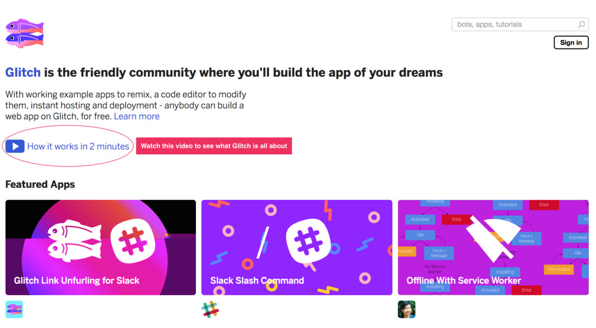

- Glitch lets you code in the browser without having to set
anything up
- Glitch lets you **remix** projects to use existing A-Frame projects as a
  starting point
- Glitch instantly publishes and hosts your site with a URL (e.g.,
  `https://aframe.glitch.me`)
- Glitch updates your A-Frame site live on every code change
- Glitch lets multiple people code on the same project

*If you are interested in setting up a local development environment, skip ahead &darr;*

---

## Glitch &mdash; Remixing an Existing Project

> Glitch lets you remix or fork an existing project and use it as a base for your
> new project. Before starting, we recommend linking Glitch to a [GitHub
> account](https://github.com/). After you remix, Glitch will give you a random
> project and URL name, which you can change.

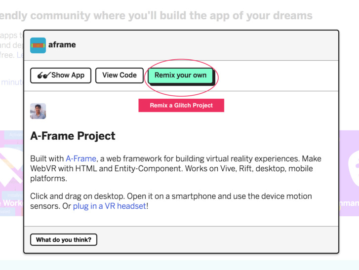

[Remix the A-Frame Starter Glitch](https://glitch.com/~aframe/)  <!-- .element: class="cta-button glitch" -->

---

## Glitch &mdash; Editing Code

> Once you've [remixed the A-Frame Starter Glitch](https://glitch.com/~aframe/),
> check out where you'll be editing your code. Poke around and see that you can
> even edit the backend server code, upload assets, create new files, or invite
> others to edit with you!

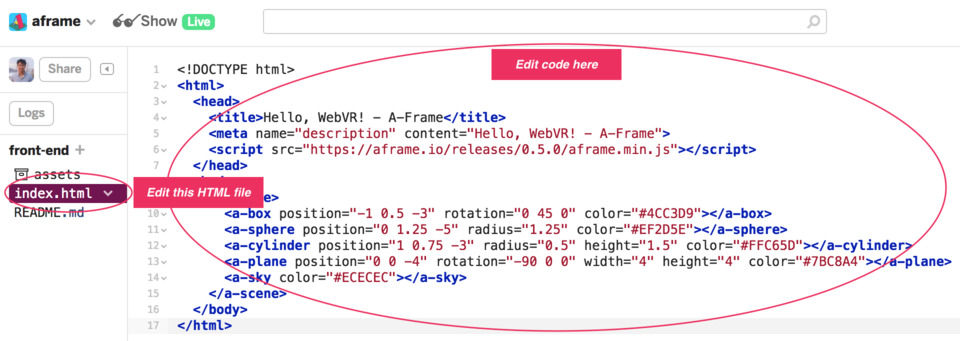

---

## Glitch &mdash; Viewing Your Project

> After you've poked around the editor, see the project live.

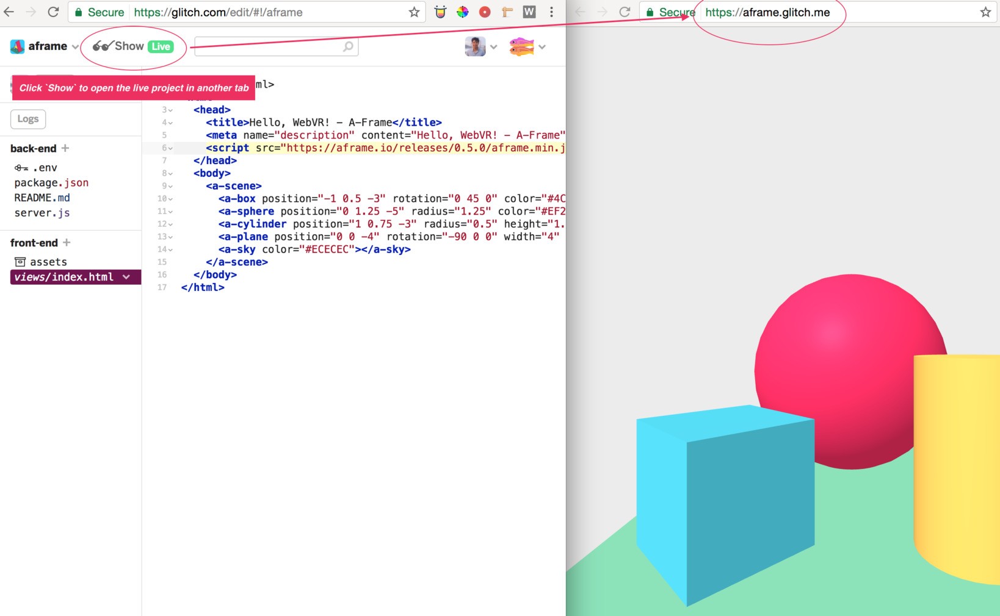

---

## Glitch &mdash; Exporting Your Project

> At any time, if you want to download your project or export to GitHub, see the
> *Advanced Options* menu. Downloading will give you a `.tgz` file which you can
> unzip. For A-Frame projects, you mostly care about what's in the `public/`
> folder, and ignore all the server-side code.

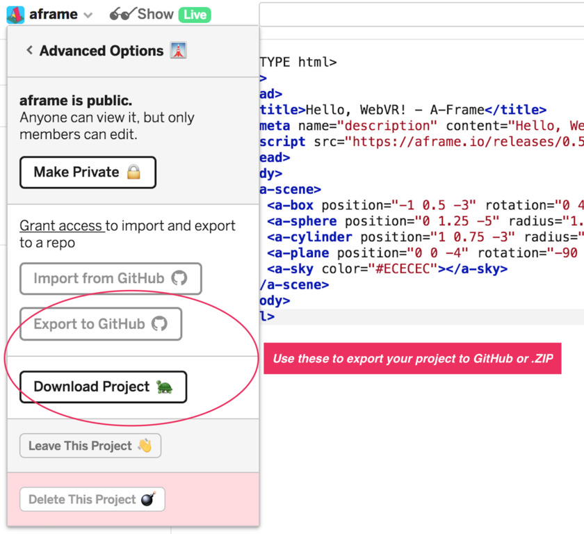

If you download a project, you
might be interested in setting up a web development environment in the next
section **&darr;**. Else, head **&rarr;** to start with A-Frame!

---

## [Optional] Set Up a Web Development Environment

> You can set up a full web development environment on your local machine, rather
> than use Glitch's online web development environment.

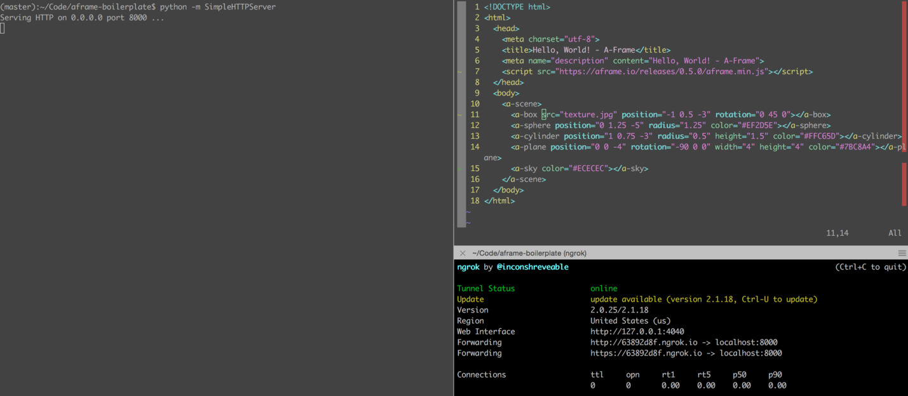

1. **Get a text editor:** [Atom](https://atom.io) is a good one to start with
2. **Set up a local server:** Download and run [Mongoose
Server](https://www.cesanta.com/products/binary) or run `python -m
SimpleHTTPServer` in a terminal
3. **Create a file `index.html`** and copy A-Frame code from the Glitch samples
4. **Run a local server** in the same directory as the HTML file
5. **Open the local server's URL** in your browser (e.g., `http://localhost:8000`)
6. **Make changes** to your HTML file and refresh your browser to see the changes
7. Optional: check out [ngrok](https://ngrok.io) to let any device on any
network have access to your local server

---

## [Optional] Set Up a Web Development Environment &mdash; Get a Text Editor

> [Atom](https://atom.io) is a good text editor to start if you don't have one.
> Other popular options are [Notepad++](https://notepad-plus-plus.org/),
> [Sublime](https://www.sublimetext.com/), [Brackets](http://brackets.io/), or
> [vim](http://www.vim.org/download.php).


---

## [Optional] Set Up a Web Development Environment &mdash; Set Up a Local Server

> You'll need a local HTTP server to serve your files to the browser.

<div class="captioned-image-row small">
  <div>
    
    <a href="https://www.cesanta.com/products/binary">Mongoose Binary</a>
  </div>
  <div>
    
    <code>python -m SimpleHTTPServer 8080</code>
  </div>
  <div>
    
    <a href="https://docs.npmjs.com/getting-started/installing-node">Node + npm + live-server</a>
  </div>
</div>

---

## [Optional] Set Up a Web Development Environment &mdash; Use ngrok

> Optionally, you can use [ngrok](https://ngrok.com/) to help develop your
> A-Frame project on a smartphone without having to do the local IP address
> dance.

1. Download and unzip [ngrok](https://ngrok.com/download/) anywhere
2. Run ngrok, providing it the port number of your local server (`./ngrok http 8080`)
3. In the output, ngrok will give you a URL with a bunch of letters and numbers (e.g., `https://abcdef123456.ngrok.io`)
4. Open that URL on another device on any network (such as a smartphone or another computer)

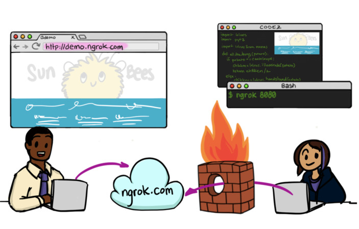

------

## Try Out A-Frame Examples

> Play with examples on your desktop or smartphone from the [A-Frame
> Homepage](https://aframe.io), [A-Frame Blog](https://aframe.io/blog/), or
> [awesome-aframe](https://github.com/aframevr/awesome-aframe). See
> [webvr.rocks](https://webvr.rocks) for information on setting up WebVR with a
> headset if you have one.


------

## Start with *Hello, WebVR*

> A-Frame provides easy-to-use HTML elements for starters called
[primitives](https://aframe.io/docs/0.5.0/primitives/). In the sections below,
we'll modify basic meshes through HTML attributes (e.g., change colors,
positions, rotations, scale) and get a feel for the workflow.

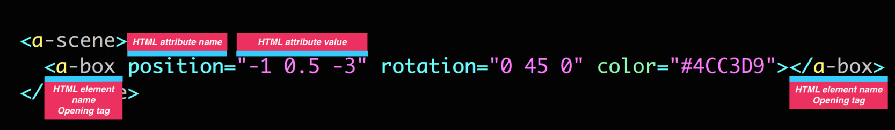

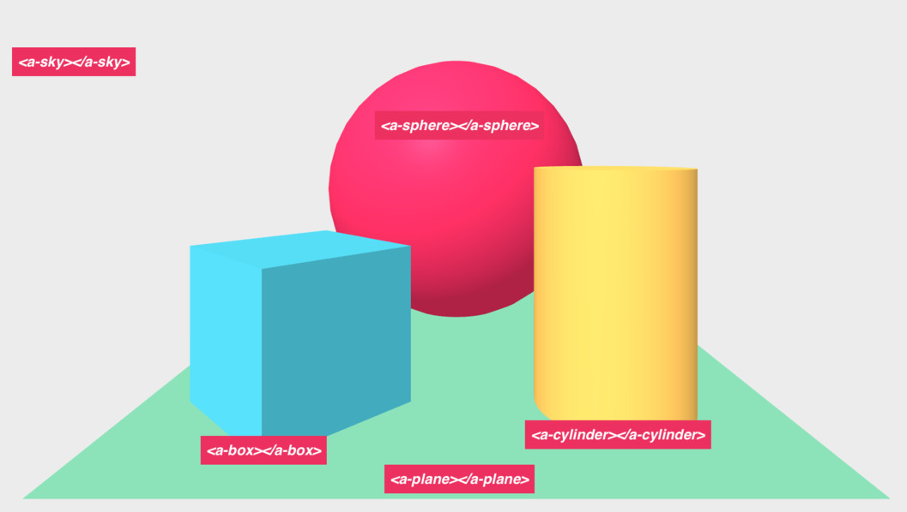

---

## Start with *Hello, WebVR* &mdash; Position

> Position defines where objects are in 3D space (X, Y, Z) in meters. Change
> the `position` of the objects via the `position` HTML attribute values. [Read about
> positions](https://aframe.io/docs/master/components/position.html).

[Remix Lesson on Glitch](https://glitch.com/~aframe-school-position)  <!-- .element: class="cta-button glitch" -->

1. Move the cylinder left by *decreasing* the `position`'s X value
2. Move the box up by *increasing * the `position`'s Y value
3. Move the sphere back by *decreasing* the `position`'s Z value
4. **Extra Credit:** Add `<a-ring>` as a child of `<a-sphere>` and give it a position to see relative positions

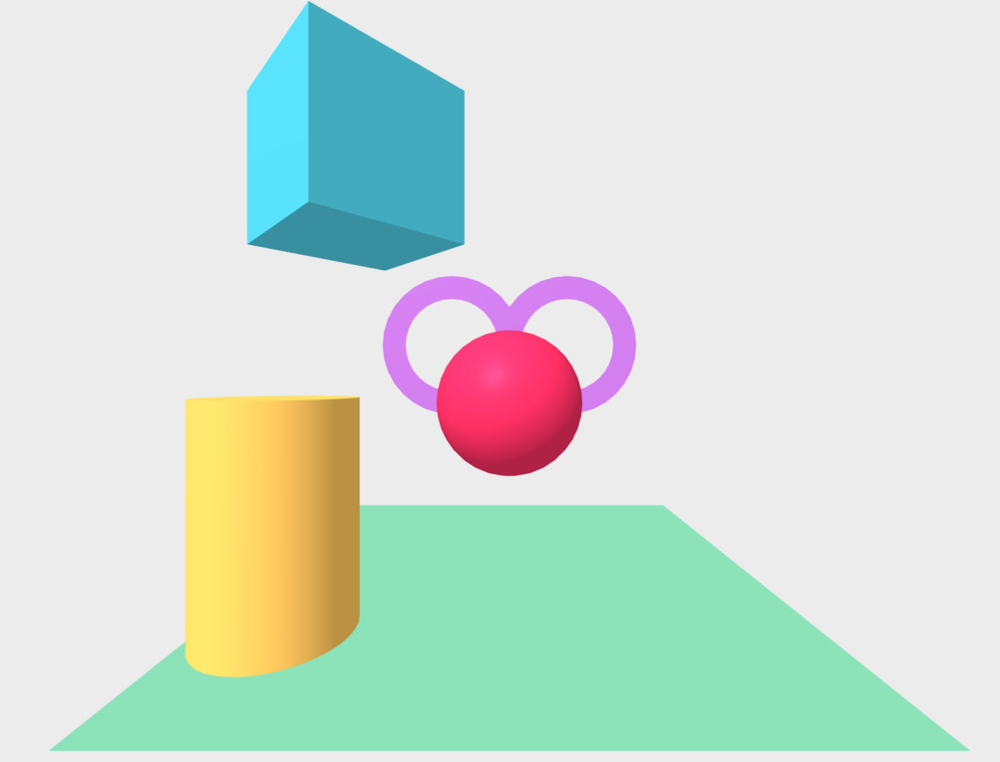

[View Result](https://aframe-school-position.glitch.me/solution.html)  <!-- .element: class="cta-button" -->

---

## Start with *Hello, WebVR* &mdash; Rotation

> Rotation defines orientation of objects in 3D space (about the X, Y, Z axes)
> in degrees. Use the right-hand rule to spatially visualize rotation. [Read about
> rotations](https://aframe.io/docs/master/components/rotation.html).

[Remix Lesson on Glitch](https://glitch.com/~aframe-school-rotation)  <!-- .element: class="cta-button glitch" -->

1. Rotate the cylinder around the X axis so we see the bottom
2. Rotate the box around the Y axis so the box is facing straight
3. **Extra Credit:** Wrap the scene contents in `<a-entity>` (like a `<div>`)
and give it a rotation to see relative rotations

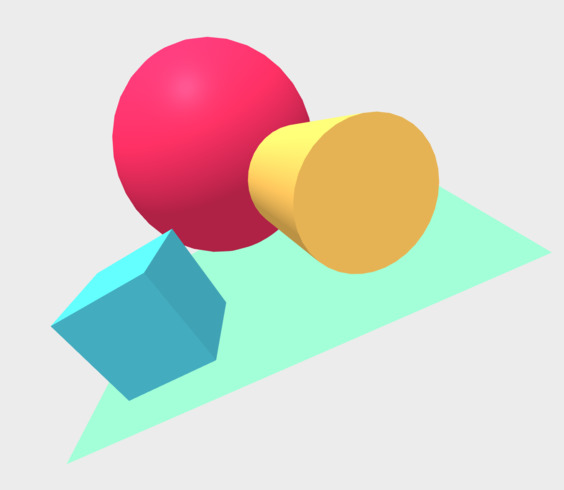

[View Result](https://aframe-school-rotation.glitch.me/solution.html)  <!-- .element: class="cta-button" -->

---

## Start with *Hello, WebVR* &mdash; Add Primitives

> Add primitives the scene by adding HTML elements under `<a-scene>`.  [Read
> about primitives](https://aframe.io/docs/0.5.0/primitives/).

[Remix Lesson on Glitch](https://glitch.com/~aframe-school-primitives)  <!-- .element: class="cta-button glitch" -->

1. Add [`<a-torus-knot>`](https://aframe.io/docs/0.5.0/primitives/a-torus-knot.html) to the left
2. Add [`<a-dodecahedron>`](https://aframe.io/docs/0.5.0/primitives/a-dodecahedron.html) to the right
3. Add [`<a-text>`](https://aframe.io/docs/0.5.0/primitives/a-text.html) aligned in the center


[View Result](https://aframe-school-primitives.glitch.me/solution.html)  <!-- .element: class="cta-button" -->

------

## Add Textures &mdash; Uploading Assets

> We'll be adding image textures to meshes to more appearance than a flat color.
> [Find your own images
> online](https://aframe.io/docs/0.5.0/introduction/faq.html#where-can-i-find-assets),
> and upload them through the assets section in Glitch or through the uploader on
> [cdn.aframe.io](https://cdn.aframe.io). Wherever else you may upload, make sure
> it's being served with
> [CORS](https://developer.mozilla.org/docs/Web/HTTP/Access_control_CORS) and
> over HTTPS.

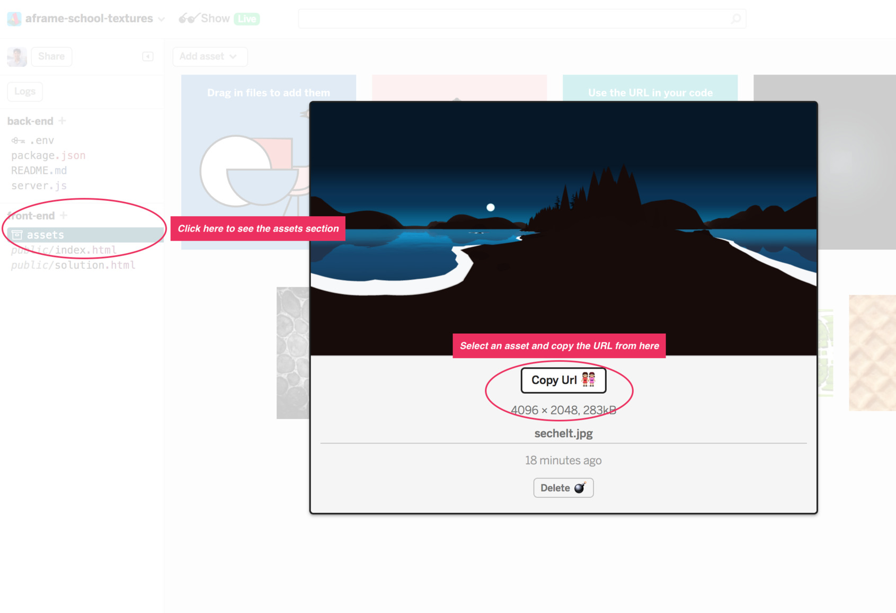

In the Glitch below **&darr;**, some assets will already be provided in the
assets section (pictured above).

---

## Add Textures &mdash; Image Textures

> Fill in the `src` HTML attributes with image URLs. [Read about applying an
> image texture](https://aframe.io/docs/0.5.0/guides/#applying-an-image-texture).

[Remix Lesson on Glitch](https://glitch.com/~aframe-school-textures/)  <!-- .element: class="cta-button glitch" -->

1. Add an image texture to the ground, `<a-plane>`
2. Add image textures to `<a-box>`es
3. Add an image texture to `<a-sphere>`
4. Add an image texture to `<a-cone>`
5. Add an image texture to the background, `<a-sky>`. Find [360&deg; images from FLickr](https://www.flickr.com/groups/equirectangular/)

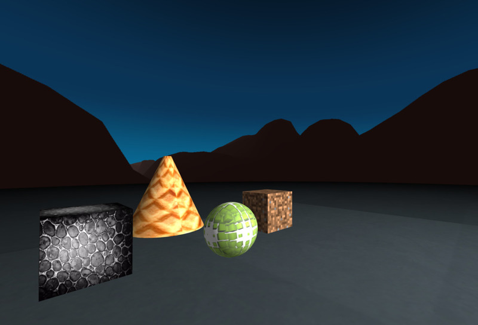

[View Result](https://aframe-school-textures.glitch.me/solution.html)  <!-- .element: class="cta-button" -->

------

## Open the A-Frame Inspector

> Hit **`<ctrl> + <alt> + i`** on **any** A-Frame scene to pop open a visual
> editor, just like your browser's Dev Tools!  Try the Inspector on some of the
> [homepage examples](https://aframe.io/examples/). [Read about the
> Inspector](https://aframe.io/docs/master/guides/using-the-aframe-inspector.html).

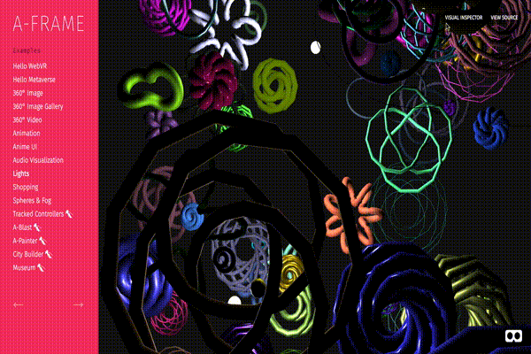

---

## Open the A-Frame Inspector &mdash; Change Component Values

> Modify an entity by modifying its components on the right-hand panel. The
> Inspector knows about all A-Frame components, including community components.
>  This example includes an external [text-geometry
> component](https://www.npmjs.com/package/aframe-text-geometry-component), which
> the Inspector can modify the values of live.

[Open Example on Glitch](https://aframe-vaporwave.glitch.me)  <!-- .element: class="cta-button glitch" -->

1. Select one of the entities with text in the example
2. Change the [`text-geometry` component's](https://www.npmjs.com/package/aframe-text-geometry-component) `value` property

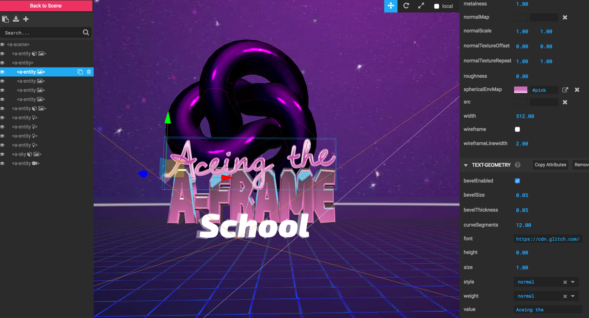

---

## Open the A-Frame Inspector &mdash; Attach Components from the Registry

> Use [physics components](https://github.com/donmccurdy/aframe-physics-system)
> from the [Registry](https://aframe.io/registry/) to add gravity and collisions.
> The Registry is a curated collection of A-Frame components. And the Inspector
> is hooked up to the Registry so we can add components from the Registry in the
> entity panel.

[Open Example on Glitch](https://aframe-vaporwave.glitch.me)  <!-- .element: class="cta-button glitch" -->

1. Add the `static-body` component to ground grid
2. Add the `dynamic-body` component to the torus knot (the purple pretzel in the back)
3. Increase the Y-position of the torus knot to make it higher up
4. Exit the Inspector

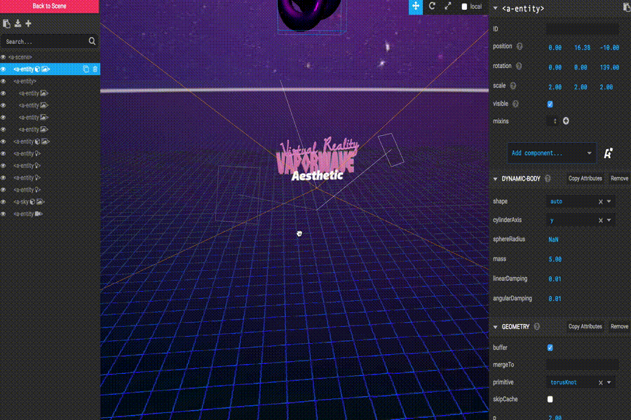

------

## Compose and Extend with Entity-Component

> Explore the entity-component pattern of A-Frame rather than using the wrapper
> primitives (e.g., `<a-box>`). [Documentation](https://aframe.io/docs/0.5.0/core/)

*Hello, WebVR* example with all the [A-Frame primitive
elements](https://aframe.io/docs/0.5.0/primitives/) represented as
`<a-entity>`s and decomposed to their fundamental components, including
[geometry](https://aframe.io/docs/0.5.0/components/geometry.html) and
[material](https://aframe.io/docs/0.5.0/components/material.html):

<p data-height="400" data-theme-id="19139" data-slug-hash="QpOXNM" data-default-tab="html,result" data-user="mozvr" data-embed-version="2" data-pen-title="Decomposing Primitives — A-Frame" data-editable="true" class="codepen">See the Pen <a href="https://codepen.io/mozvr/pen/QpOXNM/">Decomposing Primitives — A-Frame</a> by mozillavr (<a href="http://codepen.io/mozvr">@mozvr</a>) on <a href="http://codepen.io">CodePen</a>.</p>

---

## Compose and Extend with Entity-Component &mdash; Add a Light Source Sphere

> Use the entity-component pattern to add a sphere that also acts as a point
> light source. Mix together the geometry, material, and light components to
> compose this type of object.
>
> `<a-entity>` +
> [geometry](https://aframe.io/docs/0.5.0/components/geometry.html) +
> [material](https://aframe.io/docs/0.5.0/components/material.html) +
> [light](https://aframe.io/docs/0.5.0/components/light.html) = light source sphere.

[Open CodePen](http://codepen.io/mozvr/pen/gmoYWJ)  <!-- .element: class="cta-button" -->

>

<!-- NOTES -->

### Solution

```html
<a-entity geometry="primitive: sphere; radius: 0.2" material="shader: flat" light="type: point; color: #FFF" position="-4 3 -4">
  <a-animation attribute="position" to="4 2.8 -4" direction="alternate" repeat="indefinite"></a-animation>
</a-entity>
```

---

## Compose and Extend with Entity-Component &mdash; From the Registry

> Include community components (e.g.,
> [animation](https://www.npmjs.com/package/aframe-animation-component),
> [particle-system](https://www.npmjs.com/package/aframe-particle-system-component),
> from the [A-Frame Registry](https://aframe.io/registry/) via a `<script>` tag
> and use them from HTML.
> [Documentation](https://github.com/aframevr/aframe-registry#usage)

<p data-height="400" data-theme-id="19139" data-slug-hash="yMpyJr" data-default-tab="html,result" data-user="mozvr" data-embed-version="2" data-pen-title="Using the Registry — A-Frame School" data-editable="true" class="codepen">See the Pen <a href="http://codepen.io/mozvr/pen/yMpyJr/">Using the Registry — A-Frame School</a> by mozillavr (<a href="http://codepen.io/mozvr">@mozvr</a>) on <a href="http://codepen.io">CodePen</a>.</p>

------

## Code with JavaScript

> Use JavaScript and DOM APIs to programmatically modify the scene and its
> entities. A-Frame is not just HTML; A-Frame provides access to JavaScript,
> DOM APIs, and three.js underneath for full control.
> [Documentation](https://aframe.io/docs/0.5.0/guides/using-javascript-and-dom-apis.html)

In the following examples, open the CodePen, and work inside the **JavaScript**
panel rather than the **HTML** panel. If you are working from a local HTML
file, use the [browser's Developer Tools
Console](https://developer.mozilla.org/en-US/docs/Learn/Common_questions/What_are_browser_developer_tools)
as a playground.


---

## Code with JavaScript &mdash; Getting Entities

> Use
> [`document.querySelector()`](https://developer.mozilla.org/en-US/docs/Web/API/Document/querySelector)
> and
> [`document.querySelectorAll()`](https://developer.mozilla.org/en-US/docs/Web/API/Document/querySelectorAll)
> to get a reference to the scene and its entities.
> [Documentation](https://aframe.io/docs/0.5.0/guides/using-javascript-and-dom-apis.html#getting-entities-by-querying-and-traversing)

[Open CodePen](http://codepen.io/mozvr/pen/QpOXNM)  <!-- .element: class="cta-button" -->

1. Get a reference to the `<a-scene>` element using `var sceneEl = document.querySelector('a-scene');`
2. Get a reference to all `<a-entity>` elements using `sceneEl.querySelectorAll('a-entity');`
3. Get a reference to the box entity using `sceneEl.querySelector('#box');`
4. Get a reference to the sphere and cylinder entities in one `.querySelectorAll()` call by using multi-element selector
5. Get a reference to the sphere and cylinder entities in one `.querySelectorAll()` call by adding and selecting HTML classes

---

## Code with JavaScript &mdash; Modifying Entities

> Use
> [`Entity.setAttribute()`](https://aframe.io/docs/0.5.0/core/entity.html#setattribute-attr-value-componentattrvalue)
> to modify entities after retrieving them from the previous exercise. [Documentation](https://aframe.io/docs/0.5.0/guides/using-javascript-and-dom-apis.html#modifying-an-entity)

[Open CodePen](http://codepen.io/mozvr/pen/QpOXNM)  <!-- .element: class="cta-button" -->

1. Change the box entity's `rotation` component
2. Change the cylinder entity's `geometry` component's `height` property
3. Change the sphere entity's `material` component's `metalness` property
4. Change the directional light entity's `light` component's `color` property
  **Clue:** Note that if lights are not defined in HTML, A-Frame will inject
  default light entities

---

## Code with JavaScript &mdash; Creating Entities

> Use
> [`document.createElement()`](https://developer.mozilla.org/en-US/docs/Web/API/Document/createElement)
> to modify entities after retrieving them from the previous exercise. [Documentation](https://aframe.io/docs/0.5.0/guides/using-javascript-and-dom-apis.html#creating-an-entity-with-createelement)

[Open CodePen](http://codepen.io/mozvr/pen/QpOXNM)  <!-- .element: class="cta-button" -->

1. Create and add an entity with the [`light`](https://aframe.io/docs/0.5.0/components/light.html) component
2. In a JavaScript `for` loop, create and add 25 box entities with varying positions and scales

---

## Code with JavaScript &mdash; Events

> Use
> [`.addEventListener()`](https://developer.mozilla.org/en-US/docs/Web/API/EventTarget/addEventListener)
> to register a handler function that will be called when an event is emitted.
> Then manually emit that event to see that handler function execute.
> [Documentation](https://aframe.io/docs/0.5.0/guides/using-javascript-and-dom-apis.html#events-and-event-listeners)

[Open CodePen](http://codepen.io/mozvr/pen/QpOXNM)  <!-- .element: class="cta-button" -->

1. Register an event listener on the box to listen to the `foo` event. In the
   handler function, change the box's color
2. Emit the `foo` event with [`Entity.emit()`](https://aframe.io/docs/0.5.0/core/entity.html#emit-name-detail-bubbles) and see the box change its color

------

## Add Gaze-Based Cursor Interactions

> Use the gaze-based [`cursor`
> component](https://aframe.io/docs/0.5.0/components/cursor.html) to provide
> the ability to interact with entities (primarily for smartphones). This isn't
> a great interaction mechanism, but runs through basic interaction using
> events and for people that don't have a real headset with controllers on
> hand.
> [Guide](https://aframe.io/docs/0.5.0/guides/building-with-components.html)

1. Explicitly define a
   [`camera`](https://aframe.io/docs/0.5.0/components/camera.html) entity.
   Previously A-Frame was providing a default camera
2. Add a [`cursor`](https://aframe.io/docs/0.5.0/components/cursor.html) entity
   as a child of the camera entity
3. Add an event listener to one of the entities to change (e.g., color,
   position, rotation) on the `click`, `mouseenter`, or `mouseleave` events
4. Move the camera to look at an entity and "click" (stare for a second on
   mobile), and see the entity react

<p data-height="300" data-theme-id="19139" data-slug-hash="QpOXNM" data-default-tab="html,result" data-user="mozvr" data-embed-version="2" data-pen-title="Decomposing Primitives — A-Frame School" class="codepen">See the Pen <a href="http://codepen.io/mozvr/pen/QpOXNM/">Decomposing Primitives — A-Frame School</a> by mozillavr (<a href="http://codepen.io/mozvr">@mozvr</a>) on <a href="http://codepen.io">CodePen</a>.</p>

------

## Add 3D Models &mdash; glTF Model

> 3D models are like the images of 3D and VR applications, although a bit
> heavier. A 3D model is created beforehand in a 3D modeling program such as
> [Blender](https://www.blender.org/) and consists of vertices, textures,
> materials. We recommend using [glTF](https://github.com/KhronosGroup/glTF), a
> relatively new 3D file format standard tailored for the Web. glTF is like the
> JPG of 3D models.

[Remix Lesson on Glitch](https://glitch.com/~aframe-school-gltf-model)  <!-- .element: class="cta-button glitch" -->

1. Add the `https://cdn.aframe.io/test-models/models/virtualcity/VC.gltf` to
the `<a-asset-item id="model">`'s `src` attribute to preload the model
2. Add `#model` to the `<a-gltf-model>`'s `src` attribute to set and add the model


[View Result](https://aframe-school-gltf-model.glitch.me/solution.html)  <!-- .element: class="cta-button" -->

---

## Add 3D Models &mdash; glTF Model Animations

> Models can come with animations. The model provided above has many animations
> of ships zooming across the city. In the previous Glitch, we've provided a simple
> `play-all-model-animations` component that we can attach to our model to play
> its animations. Continue working from your current Glitch.

1. Include the `play-all-model-animations.js` file via a `<script>` in the
`<head>` after the A-Frame script.
2. Attach the `play-all-model-animations` component to the `<a-gltf-model>` by
setting it via an HTML attribute `play-all-model-animations`.

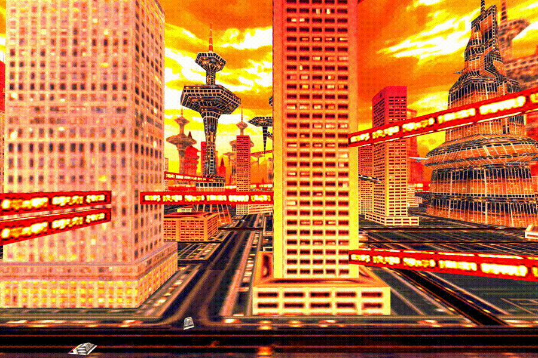

[View Result](https://aframe-school-gltf-model.glitch.me/solution2.html)  <!-- .element: class="cta-button" -->

------

## Add Tracked Hand Controls

> If you have a VR headset (i.e., Vive or Rift + Touch), add tracked hand
> controls with the [`hand-controls`
> component](https://aframe.io/docs/0.5.0/components/hand-controls.html). If
> you are at a live event or workshop and have access to the VR headset, leave
> this as homework exercises.

1. Add two entities with `hand-controls`, one for the left hand and one for the right hand
2. Enter VR, see your hands, and press buttons to see the hands animate

---

## Add Tracked Hand Controls &mdash; Add Teleport Controls

> Add
> [teleport-controls](https://github.com/fernandojsg/aframe-teleport-controls)
> to the left hand.

---

## Add Tracked Hand Controls &mdash; Add Controller Cursor

> Add
> [controller-cursor](https://github.com/bryik/aframe-controller-cursor-component)
> to the right hand.

------


<!-- Lessons end here. -->


## Stay Tuned


[More lessons to come!](https://github.com/aframevr/aframe-workshop/wiki/Brainstorm-Lessons)

See [the documentation](https://aframe.io/docs/) for more guides.
